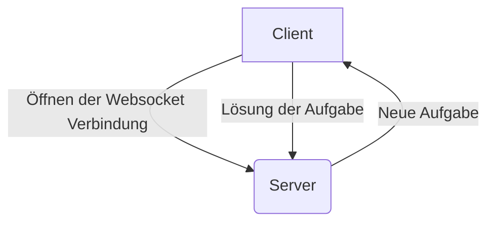

# Online-Klausuren

## Who has done this?
- [Franz](https://github.com/zuvielskill)
- Arne 
- [redsolver ~ Dominik](https://github.com/redsolver)
- [Felix](https://github.com/strifel)

## Technisches Konzept

Basispfad: **/api/v1**

`GET /tests` -> Liste aller Tests

`Test` Objekt
```javascript=
{
    name: String,
    //start: unixtimestamp[seconds] Beginn des Tests (int),
    tasks: [ (enthält "Task" Objekte)
        {"choices":{"0":"Wegen der Sonne","1":"Wegen den Affen"},"id":"01abcf1c-b6b3-422c-a822-a7bea0d462ab","type":"CHOICES","title":"Warum ist die Banane krumm?","description":"","time":60},{"id":"01abcf1c-b6b3-422c-a822-a7bea0d462ac","type":"TEXT","title":"Was ist 1+2?","description":"Bitte gebe den Rechenweg an!","time":20},
        {"choices":{"0":"Blau","1":"Grün"},"id":"01abcf1c-b6b3-422c-a822-a7beb0d462af","type":"CHOICES","title":"Welche Farbe hat das Wasser?","description":"","time":10}
    ]
}
```


### Aufgabenarten

- Multiple Choice
- Freie Aufgaben

Frontend: Website mit Flutter/Dart
    
Kommunikation zwischen Frontend und Backend: WebSocket - Auth zu Beginn der Verbindung
```javascript= 
 {function: "task", data: object}
```
    
### Verbindungsaufbau über WS
Path: **/api/v1/ws**

Header: `Authorization: Bearer $token`

Server hält eine Liste an verbundenen Clients.

-> Klausur startet

#### Zufällige Aufgabe wird an jeden Schüler geschickt 
Funktionsname: task
```javascript=
{
    task: {
        id: uuid.v4(),
     type: "multiple-choice",
        title: "Wann wurde Donald Trump geboren?",
        description: "", // In Markdown
        time: time[seconds] die man für die Aufgabe zur Verfügung hat,
        choices: {
            "0": "21. November 1942",
            "1": "14. Juni 1946",
            "2": "1. Januar 1969"
        },
    },
    deadline: unixtimestamp[seconds] Späteste Abgabezeit (int)
}
```

#### Abgabe
Funktionsname: submission
```javascript=
{
    value: "1",
    taskId: uuid.v4() // Der Server muss die Ebenfalls sich merken. Die Übergabe der Task ID ist nur zur Verifikation
}
```

#### Test zuende
Funktionsname: test_finished
``` javascript=
{}
```


### Authentifizierung
Der Client muss sich zuerst gegenüber der API dann gegenüber des Websockets authentifizieren

#### API Authentifizierung
Endpunkt: POST **/api/v1/auth**
``` javascript=
{
    type: "api", 
    username: "Test", 
    password: "123"
}
```

Bei allen API Request muss dies in dem Authorization Header als Bearer übergeben werden.
#### Websocket Authentifizierung
Endpunkt: POST **/api/v1/auth**
``` javascript=
{
    type: "test", 
    username: "Test", 
    password: "123",
    test: "ID DES TESTS"    
}
```
## Das haben wir uns überlegt
Wie kann man online Klausuren schreiben? 
    
Probleme: spicken, zeit, ...
    
    
Idee: Eine Klausur besteht aus mehreren Aufgaben, diese werden den Schülern in zufälliger Reihenfolge gestellt, dadurch wird Abschreiben verhindert. Für jede Aufgabe ist nur eine gewisse Bearbeitungszeit vorgesehen. Die Aufgaben müssten hierbei natürlich angepasst werden, damit nicht auswendig gelerntes Wissen abgefragt wird.
    
    

## Wir wollen folgende Technologien/Daten verwenden
    
Frontend: Website mit Flutter/Dart
    
Kommunikation zwischen Frontend und Backend: WebSocket - Auth zu Beginn der Verbindung
    ```{"function": "TEST", "data": ""}```
    
Backend: Java/JVM
    
    
    
    
-> Websocket Verbindung


## Programming
### Server
- Felix
- Arne
- Franz

### Client
- Dominik

